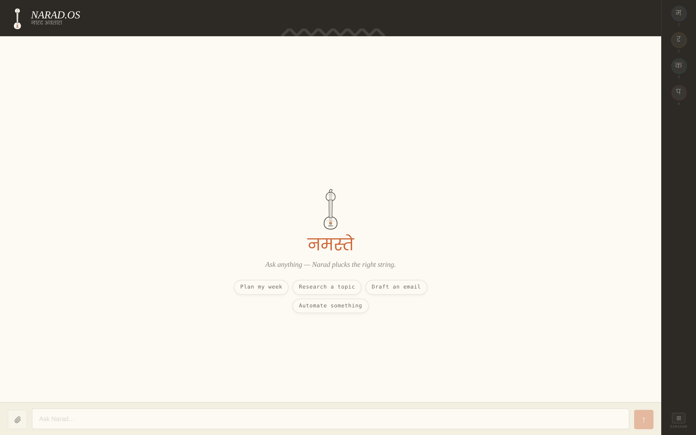
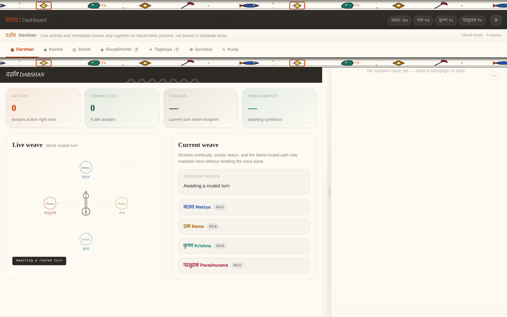
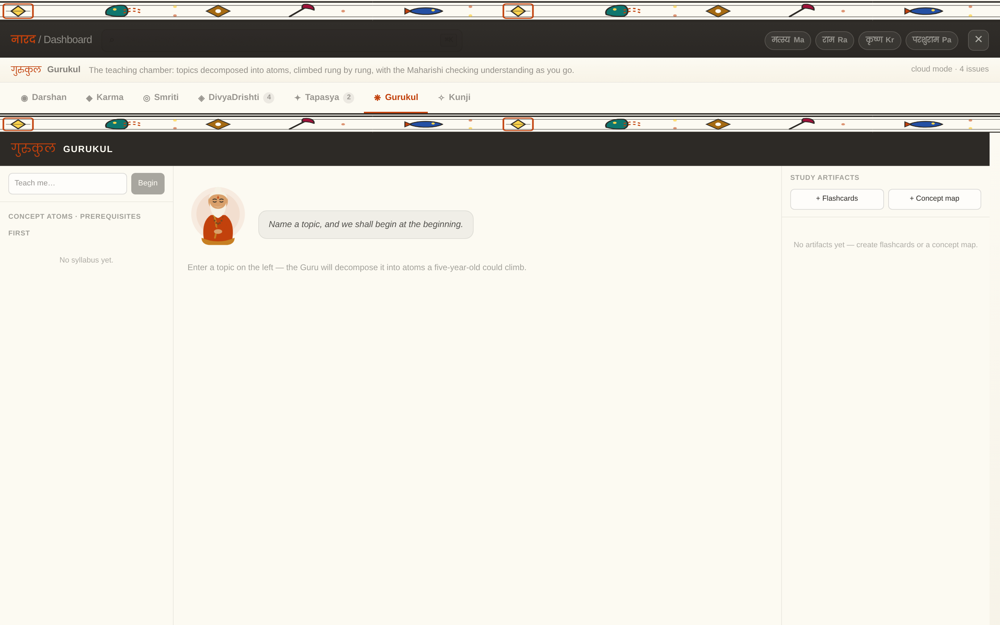
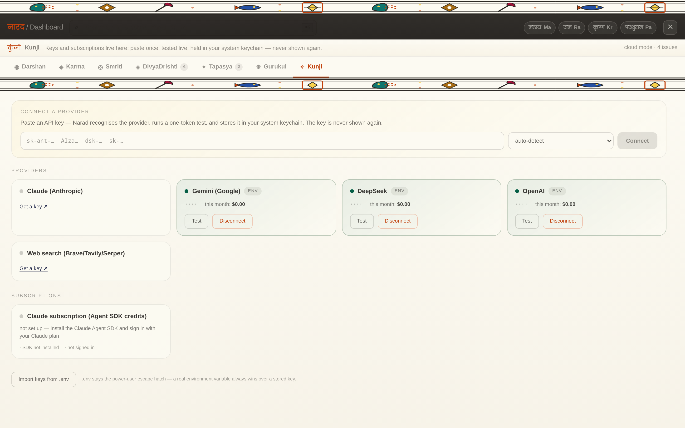

# Narad

> *"We didn't invent multi-agent AI. We remembered it."*

Four canonical agents. One sage who plays them. Cloud now, local later, yours forever.




---

## What this is

**Narad** is the product — the orchestrator. An AI system modelled on the kalakar Narad Muni, who holds the Mahati veena and decides which string to pluck for every task.

**Avatāra** (अवतार) is the concept — what Silicon Valley now calls "agents." A form that descends with purpose, completes its mission, and releases. The Bhagavad Gita described this API specification three thousand years ago.

The Mahati now has four canonical strings in the shipped build. Narad summons the right one for the work at hand.

---

## The four canonical agents

| Avatāra | Sanskrit | Domain |
|---|---|---|
| Matsya | मत्स्य | Web search, document understanding, research synthesis, local information access |
| Rama | राम | Structured planning, calendar management, finance workflows, health logging |
| Krishna | कृष्ण | Communication drafting, email, education, media generation, wellness guidance |
| Parashurama | परशुराम | Code, shell execution, SQL, automation, document output |

**Narad** routes. **Smriti** remembers. **Tapas** learns. **Sankalpa** adapts. **Yantra** observes. **Karma** records. **Sutras** compound.

---

## A look around

| | |
|---|---|
|  |  |
| **Darshan** — the live weave: which avatāras are awake, what was routed, token footprint | **Gurukul** — the teaching chamber: topics decomposed into atoms, climbed rung by rung |
|  |  |
| **Kunji** — paste a key once; auto-detected, live-tested, held in your OS keychain | **Voice mode** — hands-free, fully local: speak, Narad answers in the avatāra's voice |

---

## Architecture in one breath

```
User → Narad (supervisor) → 1–3 avatāras (specialists)
             ↑                        ↓
        Smriti (recall)        Tapas (score → sutra)
        Sutras (inject)        Yantra (trace)
        Sankalpa (style)       Karma (audit)
```

Full technical architecture: [ARCHITECTURE.md](./ARCHITECTURE.md) · Manual test plan: [docs/MANUAL_TESTPLAN_2026-07-09.md](./docs/MANUAL_TESTPLAN_2026-07-09.md)

---

## Repository layout

```
(root)          The harness layer — shared by every phase
  narad_paths.py          Single-source sys.path bootstrap (replaces scattered inserts)
  narad_config.py         Canonical path constants (NARAD_HOME, TRACE_DIR, CONFIG_DIR, …)
  narad_server_entry.py   `narad-server` console entry point (127.0.0.1:8000 by default)
  dharma.py               Policy gates — fail-closed action permissions (executor, email, …)
  smriti_core.py + smriti_*.py  Memory: episodes, commitments, vector tiers, recall ranking
  guru_engine.py          Teaching: syllabus atoms, four rungs, mastery grading, reviews
  tier_engine.py          Sopan: hardware detection → Gemma 4 ladder recommendation
  kunji.py                Key management: prefix detect, live test, OS keychain storage
  subscription_providers.py  Claude Agent SDK plan-credit adapter registry
  cost_ledger.py          Per-model spend tracking (narad-local/ and subscription pinned $0)
  kala_scheduler.py       Time-based loop — reminders, Swapna hour, due reviews
  vahana.py               Notification channel (inbox + optional ntfy push to phone)

phase-1/        FastAPI SSE server · Narad router · canonical 4-agent build
  server.py               POST /chat SSE stream + all endpoints (learning, connections, tiers, karma)
  narad_agent.py          Narad supervisor (DeepSeek V4)
  avatar_agents.py        4 LlmAgent specialists + _make_avatar_tool (Smriti/Sutra/Sankalpa gates)
  model_config.py         Per-avatar model assignments (LiteLLM strings, env-overridable)
  model_registry.py       Provider detection, context windows, fallback candidates
  runtime_contract.py     Startup checks → capabilities the UI renders honestly
  context_governor.py     Token budgeting per model
  kanban.py / andon.py / narad_5s.py   Six Sigma quality layer

phase-2/        Memory · Search · Observability
  smriti.py               LanceDB vector memory + FTS5
  matsya_search.py        Tavily web search
  yantra.py               JSONL session tracer

phase-3/        Self-evolution
  tapas.py                Quality scoring + sutra promotion

phase-4/        Frontend (React 18 · Vite 6 · Tailwind 4 · PWA)
  frontend/src/
    hooks/useAvatara.ts             SSE state machine
    lib/agent-contracts.ts          Avatar identity from contracts/agent-contracts.json
    components/ChatPanel.tsx        Conversation surface + suggestion chips
    components/AwarenessBar.tsx     Right-edge presence rail (Devanagari initials, Mahati strings)
    components/MahatiLogo.tsx       The veena — four strings, plucked by the active avatāra
    components/NaradDashboard.tsx   Tabbed drawer: Darshan · Karma · Smriti · DivyaDrishti · Tapasya · Gurukul · Kunji
    components/GurukulTab.tsx       Teaching chamber — syllabus tree, lesson canvas, artifacts
    components/KunjiTab.tsx         Connections — paste-a-key, provider cards, subscriptions

phase-5/        Sutra engine · Karma log
  sutra_engine.py         Sutra lifecycle (pending → active → reverted)
  karma_log.py            Append-only mutation audit trail

phase-6/        Sankalpa engine
  sankalpa.py             Per-user style and intent modeling

phase-7/        Code executor · Media generation
  executor.py             AST-analyzed, env-scrubbed, time/output-capped Python runner
  skills/video_skill.py   create_video() — moviepy + Pillow

phase-8/        Tier 1 skills (all core domains fully tooled)
  local_skill.py        scan_directory, move_to_trash, organize_by_type (Matsya/Parashurama support)
  shell_skill.py        run_shell — sandboxed shell commands (Parashurama)
  sql_skill.py          query_database — read-only SQL (Parashurama)
  email_skill.py        compose_email, send_email via SMTP (Krishna)
  calendar_skill.py     get/create CalDAV events (Rama)
  docling_skill.py      extract_document — pymupdf/python-docx default; NARAD_USE_DOCLING=1 for docling (Matsya)
  browser_skill.py      browse_url — JS-rendered pages (Matsya)
  document_skill.py     create_document() — DOCX via python-docx (Parashurama)
  browser_act_skill.py  browser_screenshot, browser_fill, browser_upload_and_submit (Matsya)
  finance_skill.py      import_csv, sync_gmail, budgets, goals, get_spend_patterns (Rama discipline)
  health_skill.py       log_symptom, set_medication_reminder, get_health_log (Rama/Krishna discipline)

phase-9/        Project system · Smriti v2 · skills · tests
  scribe.py               Post-session wiki compiler
  smriti_v2.py            Project-scoped Markdown wiki + get_project_context()

contracts/agent-contracts.json   Single source of truth: 4 canonical agents, UI colors, tools
benchmarks/                      Golden-task baselines + security re-test snapshots
evals/golden_tasks.json          48+ structural CI checks (incl. guru group)
```

Historical spikes (phase-0a routing eval, phase-0b ADK+SSE PoC) live on the `archive/spikes` branch.

---

## Setup

Requires **Python ≥ 3.11**, **Node ≥ 20**, and git. Tested on macOS (Apple Silicon) and Linux.

**1. Clone and install the backend**

```bash
git clone https://github.com/vn-envy/Narad.git && cd Narad
python3 -m venv .venv && source .venv/bin/activate
pip install -e .
```

**2. Build the frontend** (once — the server serves it itself, one origin, no CORS)

```bash
cd phase-4/frontend && npm ci && npm run build && cd ../..
```

**3. Run**

```bash
narad-server
```

Open http://127.0.0.1:8000.

**4. Add keys** — paste them in the UI (Dashboard → **Kunji** tab; stored in your OS keychain, live-tested), or export the old way:

```bash
export DEEPSEEK_API_KEY=dsk-...    # router + avatāras + Tapas judge
export GEMINI_API_KEY=AIza...      # Smriti embeddings + media
export TAVILY_API_KEY=tvly-...     # optional: Matsya web search
```

The server starts with zero keys and degrades honestly — the UI shows exactly which capabilities are live.

For development, `npm run dev` in `phase-4/frontend` gives live reload on :5173.

### Voice (optional, fully local)

Narad talks and listens without any cloud key:

```bash
pip install -e ".[voice]"          # Kokoro-82M TTS (CPU-fast) + faster-whisper STT
brew install espeak-ng ffmpeg      # macOS; on Linux: apt install espeak-ng ffmpeg
```

`[voice-pro]` instead adds VoxCPM (GPU/Apple Silicon — higher quality, Hindi, zero-shot voice cloning). Models download on first use (~800MB one time).

Click **voice** in the chat header for hands-free mode: speak, Narad answers aloud in the avatar's voice; talk over it to interrupt; toggle हिन्दी for Hindi output. Engine resolution is automatic (VoxCPM → Kokoro → Sarvam cloud only if `SARVAM_API_KEY` is set — zero API credits by default); check `GET /voice/status`. With nothing installed, voice input falls back to browser speech recognition.

Tuning env vars: `NARAD_WHISPER_MODEL` (tiny/base/small/medium), `NARAD_TTS_ENGINE` (auto/kokoro/voxcpm/sarvam), `NARAD_VOXCPM_MODEL`, `NARAD_VOICE_REF_DIR` (per-avatar `<avatar>.wav` + `.txt` reference for cloning).

### Security defaults

- Binds `127.0.0.1` — nothing is exposed to the network unless you rebind.
- Bearer token auto-generated at `~/.narad/config/api_token` (chmod 600). `NARAD_AUTH=local` (default) trusts loopback; `strict` requires the token on every request; `off` is for tests.
- Dharma gates: executor runs, email send, and browser form-fill are policy-gated and fail closed; every decision lands in the Karma log.
- Executor sandbox: AST import/call analysis, env scrubbed to an allowlist (no API keys cross), wall-clock and output caps.

## From your phone

The frontend is a PWA (installable, portrait, standalone) and the server is transport-agnostic. The supported phone path keeps the loopback bind:

```bash
# On the machine running narad-server (Mac/Linux), with Tailscale installed:
tailscale serve --bg 8000
```

Then on your phone (same tailnet): open `https://<machine>.<tailnet>.ts.net` → everything works because `tailscale serve` proxies via loopback (passes `NARAD_AUTH=local`) and gives you real HTTPS. Add to Home Screen → Narad runs as a standalone app: chat with Narad, watch the avatāras pluck, open Gurukul lessons, manage keys in Kunji.

Push notifications (reminders, due reviews, budget warnings) ride ntfy: install the ntfy app, subscribe to your topic, and set `NTFY_URL` + `NTFY_TOPIC` on the server. Vahana delivers to both the in-app inbox and your phone.

Avoid `--host 0.0.0.0` on untrusted networks; if you must rebind, run `NARAD_AUTH=strict` so every request needs the bearer token.

---

## Build phases

| Phase | Name | Status |
|---|---|---|
| 0a | Model evaluation spike — routing accuracy on local 4B model | ✅ Done |
| 0b | ADK + SSE PoC — architecture validated | ✅ Done |
| 1 | Live LLM agents — Narad + canonical 4-agent build on DeepSeek, ADK runner | ✅ Done |
| 2 | Memory + Search + Observability — Smriti, Matsya search, Yantra | ✅ Done |
| 3 | Tapas — quality scoring, sutra promotion, avatar rubrics | ✅ Done |
| 4 | Frontend — React SSE UI, DarshanPanel call graph | ✅ Done |
| 5 | Sutra engine + Karma log — learned pattern lifecycle | ✅ Done |
| 6 | Sankalpa engine — per-user style modeling | ✅ Done |
| 7 | Code executor + media generation — video, audio via Parashurama | ✅ Done |
| 8 | Tier 1 skills — all 4 canonical agents fully tooled | ✅ Done |
| 9 | Resume tailoring + job application — DOCX output + interactive browser | ✅ Done |
| 10 | Observability v2 + memory refinements + Dharma guardrails | ✅ Done |
| 11 | Project detection, Scribe wiki compiler, left-panel UX | ✅ Done |
| 12 | AssetOpsBench integration, typed traces, Markov spend patterns, health anomaly detection | ✅ Done |
| 13 | Six Sigma quality layer — Kanban, Andon, 5S, DMAIC + Darshan Dashboard overhaul | ✅ Done |
| 14 | Notion sync bridge | ❌ Cut (M0, 2026-07-04 — one-way stub, silent failures) |
| 15 | Desktop packaging (Tauri) — local Gemma 4 brain, offline-first, signed installer | 🔨 Next (O1/O2 in GURU-AND-ONBOARDING-PLAN.md) |

---

## License

Apache 2.0. The OSS edition is fully featured — the moat is the compounding Tapas relationship, not artificial feature gates.
