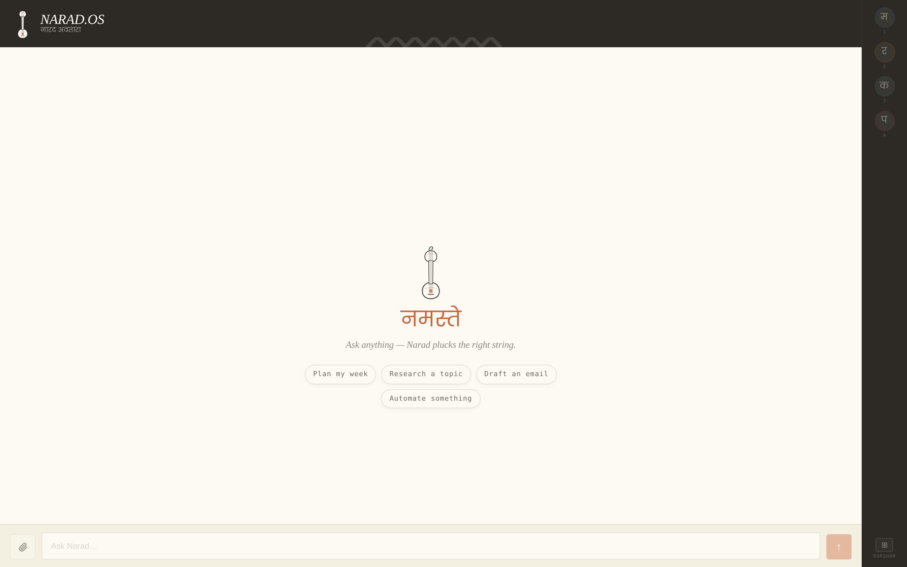

# Narad

<p align="center">
  <strong>A local-first personal AI harness for work, learning, and everyday life.</strong><br>
  One supervisor, four specialists, six durable workflows, and memory that stays yours.
</p>

<p align="center">
  <a href="https://github.com/vn-envy/Narad/actions/workflows/ci.yml"></a>
  
  
  
  <a href="./LICENSE"></a>
</p>

<p align="center">
  
</p>

> **Pilot status:** Narad is usable today on desktop and mobile, including isolated family profiles. External actions remain preview-first and require explicit consent.

## Why Narad

Most assistants give you a chat box. Narad provides a small personal operating system:

- **Useful without a subscription.** A managed local Gemma fallback starts with no API key and upgrades its size based on available RAM.
- **One interface, four specialists.** Research, planning, teaching, communication, code, and automation route through a single supervisor.
- **Work that survives the chat.** Guided workflows, learning records, artifacts, attachments, schedules, and memory persist locally.
- **Real tools, bounded authority.** Web research, Google Workspace, browser use, desktop control, and Android control are scoped, previewed, and audited.
- **Built for people, not seats.** Family profiles isolate conversations, memory, files, OAuth tokens, workflows, and device grants on one shared installation.

## Four Surfaces

| Surface | What it is for |
|---|---|
| **Chat** | The universal path for questions, files, folders, URLs, voice, tool calls, and native artifacts. |
| **Workflows** | Durable paths for Career, Health, Travel, Teach Anything, Personal Finance, and Documents. |
| **Memory** | Personal recall, commitments, and durable preferences without exposing an internal project-management system. |
| **System** | Runtime health, models, traces, connections, permissions, and profile-scoped device access. |

There is no separate Projects or Kanban surface. Workflow stages are the progress model; normal chat stays open-ended.

## The Four Avatars

| Avatar | Owns |
|---|---|
| **Matsya** | Web research, source synthesis, document understanding, browser/computer use, and local information access. |
| **Rama** | Planning, calendars, finance, health tracking, recurring reviews, and structured decisions. |
| **Krishna** | Teaching, writing, email, presentations, native learning artifacts, media, and wellness guidance. |
| **Parashurama** | Code, shell, SQL, automation, engineering analysis, and operational documents. |

Narad routes. Smriti remembers. Tapas evaluates. Dharma gates actions. Yantra traces. Kala schedules. Karma records.

## Built-In Workflows

| Path | Closed loop |
|---|---|
| **Career** | Research roles -> rank fit -> tailor application -> review submission -> prepare -> learn from outcomes. |
| **Health** | Establish baseline -> set safety boundary -> plan food and movement -> track -> adapt weekly. |
| **Travel** | Capture constraints -> research live options -> compare -> build itinerary -> review bookings -> re-plan changes. |
| **Teach Anything** | Set a learning mission -> diagnose -> teach one concept -> check understanding -> reinforce -> schedule review. |
| **Personal Finance** | Import local data -> analyze cash flow -> ground assumptions -> compare scenarios -> review monthly. |
| **Documents** | Ingest evidence -> analyze -> shape narrative -> create report, presentation, or story -> revise. |

Every run keeps intake, stage state, outputs, citations, confirmations, schedules, and feedback. See [Workflow Paths](./docs/WORKFLOW_PATHS.md) for the runtime contract.

## Quick Start

Narad requires Python 3.11+, Node 20+, and Git. macOS on Apple Silicon is the primary pilot environment; the core server also supports Linux.

### macOS: no-terminal setup

Clone or download the repository, then double-click:

```text
Start Narad.command
```

The launcher creates the virtual environment, installs dependencies, builds the frontend, starts Narad on loopback, and opens the app.

### Terminal setup

```bash
git clone https://github.com/vn-envy/Narad.git
cd Narad

python3 -m venv .venv
source .venv/bin/activate
pip install -e ".[dev]"

cd phase-4/frontend
npm ci
npm run build
cd ../..

narad-server
```

Open [http://127.0.0.1:8000](http://127.0.0.1:8000).

For live frontend development:

```bash
./dev.sh
```

## Four-Step Onboarding

1. **Create your profile.** Choose a display name and, in family mode, a private PIN.
2. **Choose the brain.** Use the local model or connect a supported hosted endpoint.
3. **Connect your world.** Grant Google and optional computer/phone access only to the active profile.
4. **Start with a path.** Open normal chat or launch one of the six guided workflows.

The default local ladder is deliberately simple:

- Under 16 GB RAM: Gemma 4 E2B Q4
- 16 GB RAM and above: Gemma 4 E4B Q4

Narad downloads the selected Ollama model only when requested, lazy-loads it on first use, and releases it quickly on constrained machines. A healthy connected endpoint can become the text and multimodal default; model routing is not tied to one vision vendor. Hosted routing prefers DeepSeek, then another connected provider with published API data terms (Gemini, OpenAI, Anthropic, or a custom OpenAI-compatible endpoint), then local Gemma; xAI/Grok is disabled by owner policy.

## Attach Anything Relevant

The chat composer accepts images, documents, data files, source code, archives, and folders. Paste an HTTP(S) URL directly for Matsya to retrieve the live page.

Uploads are stored under `~/.narad/attachments/`. Models receive bounded extracts plus exact reread references instead of an ever-growing raw prompt. Default limits are 50 MB per file, 200 MB per selection, and 256 files.

## Reading Documents

Photograph a lab report, bank statement, prescription, bill or school circular (Hindi, English or both) and ask Narad to save it. Matsya reads it on the Mac and shows a review card; nothing reaches your health or finance records until you confirm each value.

1. **Local OCR.** Photos (JPG, PNG, WebP, HEIC) and scanned PDF pages are read on the Mac, turned upright from the phone's orientation. A PDF page with a text layer is used as it is. The default engine is PaddleOCR PP-OCRv5 (Devanagari and English); Surya is optional (`NARAD_OCR_ENGINE=paddle|surya|auto`). The model loads on first use and unloads after 2 minutes idle (`NARAD_OCR_IDLE_UNLOAD_S`).
2. **Values, not guesses.** Only the text goes to the worker model, through the privacy gateway, so DeepSeek sees placeholders instead of names. A value is kept only if its numbers and dates are printed on the page; anything else is left out.
3. **Check against the photo.** The review screen (`/?review=<id>`, or the card in chat) shows each value beside the crop it came from. Unclear or handwritten values start unticked. Tick, edit or drop each one, then save.
4. **What saving does.** Lab values go to `health.db` (`lab_results`), so you can later ask "how has my HbA1c changed?". Statement debits go to `finance.db`, without duplicating a CSV import. Medicine reminders, calendar events and reminders are created only if you tick them. Every saved value keeps a link to its crop.
5. **Hard pages.** For handwriting or a difficult table, the review offers to send that page image to a trusted vision model (Gemini, Claude or OpenAI) or a local one. It is your choice each time, and the call is logged in your privacy record.

Install the OCR engine on the host Mac:

```bash
source .venv/bin/activate
pip install -e ".[ocr]"      # PaddleOCR, pillow-heif (HEIC), PyMuPDF
python scripts/bench_local_stack.py --image ~/Downloads/lab_report.jpg   # time a page
```

PaddleOCR's code and model weights are Apache-2.0; the models download once on first use. Surya (`pip install surya-ocr`) has Apache-2.0 code, but its weights use a modified OpenRAIL-M licence (free for personal use and organisations under $5M revenue or funding), and on Apple Silicon it runs through a local llama.cpp server.

## Connections and Local Control

Optional integrations expand Narad without becoming startup requirements.

| Integration | Purpose | Boundary |
|---|---|---|
| **Google Workspace** | Gmail, Calendar, Drive, and Photos | One OAuth client for the installation; separate tokens and consent per profile. |
| **Exa** | Current search, extraction, highlights, and cited research | Research only; it does not control authenticated pages. |
| **BrowserSkill / Playwright** | Isolated browsing or a profile-granted signed-in Chromium session | Stateful submissions remain confirmation-gated. |
| **CUA Driver** | Typed desktop control on the host Mac | Requires macOS Accessibility and Screen Recording permission plus a profile grant. |
| **Artemis** | Android observation and action through local ADB | Devices are paired locally and granted to one profile at a time. |
| **Jev** | Deterministic admission and post-action verification | Scores desktop and phone runs; it does not replace model reasoning. |

Narad works when these services are absent. Capability reporting tells the UI what is ready, preview-only, or unavailable instead of failing behind a generic tool error.

## Family Pilot

One host can serve multiple family members while keeping their personal state separate. Each profile gets its own:

- chat sessions and working context
- Smriti memory and learned preferences
- attachments, artifacts, and teaching records
- workflows, health records, and finance records
- Google OAuth token and consent state
- browser, desktop, and Android device grants

Model weights and installation-wide provider configuration are shared so the machine does not duplicate large downloads.

The included maintainer launcher publishes the loopback server through an outbound Cloudflare Tunnel:

```text
Start Family Pilot.command
```

It expects a configured Cloudflare tunnel token at `~/.cloudflared/narad-token`. Set `NARAD_PUBLIC_URL` in the untracked `.env`, so the family's address never enters git. You can override `NARAD_CLOUDFLARE_TOKEN_FILE` the same way. The launcher enables strict profile authentication, keeps Narad bound to `127.0.0.1`, starts optional CUA and Artemis runtimes when installed, and keeps the host awake while the pilot is running.

Phones need only a modern browser and the HTTPS URL. Android ADB pairing is required only when Narad should operate the phone itself.

### Family access with Cloudflare Access

Cloudflare Access puts an email sign-in in front of the tunnel, so only the people you list ever reach Narad's profile gate. Narad then checks the Access token on every tunnelled request itself, so a missing or mistyped policy fails closed instead of exposing the gate.

1. In the Cloudflare dashboard open **Zero Trust → Access → Applications → Add an application → Self-hosted**.
2. Name it Narad and add a public hostname matching the host in your `NARAD_PUBLIC_URL`. Set the session duration, for example 1 month, so phones are not asked to sign in every day.
3. Under login methods keep **One-time PIN** (or add Google under Zero Trust → Settings → Authentication and select it).
4. Add an **Allow** policy whose Include rule is **Emails**, listing each family member's address.
5. Optional, for an uptime monitor: add a second self-hosted application for the same hostname with path `/health` and a **Bypass** policy that includes Everyone. Narad exempts only `GET /health`.
6. Save, then copy the **Application Audience (AUD) Tag** from the application's overview. Your team domain, `<team>.cloudflareaccess.com`, is under Zero Trust → Settings.
7. Add both to the untracked `.env` and restart `Start Family Pilot.command`:

```bash
NARAD_CF_ACCESS_TEAM_DOMAIN=<team>.cloudflareaccess.com
NARAD_CF_ACCESS_AUD=<application-audience-tag>
```

With both set, a tunnelled request without a valid Access token gets `403`. Requests made directly on the Mac at `http://127.0.0.1:8000` are unaffected. The launcher warns when either value is missing.

#### Adding someone new (at home or elsewhere)

Where someone lives does not matter; their email and an invite do.

1. Add their email to the Access application's Allow policy.
2. As the owner, create a Narad invite code: on the profile gate choose **Add person → Owner: create an invite code**, or call `POST /profiles/invites` with the owner's session. Each code works once, for 72 hours.
3. They open your `NARAD_PUBLIC_URL` on their Android phone, enter their email, and type the one-time PIN Cloudflare emails them.
4. On Narad's gate they choose **Add person**, enter the invite code, and pick their own PIN.
5. They install the app from Chrome's menu (**Install app** or **Add to Home screen**).

One installation supports up to 12 profiles and holds one household's data on one Mac. Another household should run its own Narad on its own Mac rather than join yours.

### Running the pilot day to day

For an always-on host, let launchd supervise Narad instead of keeping `Start Family Pilot.command` open. Stop the launcher (Ctrl-C in its window), then on the Mac run:

```bash
scripts/install_launchd.sh install     # safe to run again: unchanged jobs keep running
scripts/install_launchd.sh status      # jobs, /health, backups, the last drill, power settings
scripts/install_launchd.sh uninstall   # back to the double-click launcher; data and backups stay
```

This installs per-user LaunchAgents; no sudo is needed. They read the same `.env` as the launcher, through `scripts/pilot_env.sh`.

| Job | What it does |
|---|---|
| `com.narad.backend` | Runs Narad and restarts it if it exits, at most once a minute |
| `com.narad.tunnel` | Runs the Cloudflare tunnel, when `cloudflared`, the token file and `NARAD_PUBLIC_URL` all exist |
| `com.narad.watchdog` | Checks `/health` every 2 minutes and restarts the backend after 3 failures in a row; also rotates logs over 10 MB |
| `com.narad.uptime` | Runs `scripts/uptime_ping.py` every 5 minutes |
| `com.narad.backup` | Makes the encrypted backup every day at 03:30 |
| `com.narad.drill` | Runs the restore drill on Sundays at 04:30 |
| `com.narad.awake` | Runs `caffeinate -s`, so the Mac doesn't sleep while it's on the charger |

A few things to know:
- Logs are in `~/Library/Logs/Narad`.
- LaunchAgents run only while you are logged in, so log in once after the Mac restarts.
- `install` prints the `sudo pmset` commands that keep the Mac awake on the charger, with the lid open or closed. It doesn't run them; you run them yourself.

**Backups.** Every night, an encrypted (AES-256-GCM) snapshot of `~/.narad` goes to `~/NaradBackups`. To use an external disk or an iCloud Drive folder instead, set `NARAD_BACKUP_DIR` in `.env`.
- **What's left out:** caches, logs, downloaded models and browser caches. SQLite databases are copied with SQLite's online-backup API.
- **The key:** it lives at `~/Library/Application Support/Narad/backup.key`, outside `~/.narad`. The first backup creates it and tells you how to save a copy in your password manager. Without the key, no backup can be restored.
- **Retention:** 14 daily and 8 weekly backups are kept.

```bash
.venv/bin/python scripts/narad_backup.py list
.venv/bin/python scripts/narad_backup.py drill                          # restore the newest into a temp folder and verify it
.venv/bin/python scripts/narad_backup.py restore --to ~/narad-restored
```

To replace a live `~/.narad`:
1. Run `scripts/install_launchd.sh uninstall`.
2. Move `~/.narad` aside.
3. Run `narad_backup.py restore --to ~/.narad`.
4. Install the jobs again.

**Uptime.** Each check lands in `~/.narad/ops/uptime.jsonl`, with "Narad down" kept apart from "tunnel down".
- **Alerts:** put a healthchecks.io-style URL in `NARAD_UPTIME_PING_URL` to hear when checks fail or stop.
- **Checking through Cloudflare Access:** add the `/health` Bypass policy (step 5 above). The check then reaches the Mac through the tunnel, instead of stopping at Access.
- **The report:** `.venv/bin/python scripts/uptime_report.py` shows uptime over the last 7 days in waking hours. Waking hours are 07:00–23:00 by default; change them with `NARAD_WAKING_HOURS`. The pilot's gate is 99%.

**Weekly scorecard.** `.venv/bin/python scripts/weekly_scorecard.py` prints a Markdown scorecard. It covers uptime, backups, the drill, consent, and each person's counts and outcomes, never prompts or replies. The owner can also open `/pilot/metrics?scope=all&format=markdown`. [Pilot consent and metrics](./docs/PILOT_CONSENT_AND_METRICS.md) has the consent sheet for each person, what every number means, and the weekly review.

### Google owner setup

Create one Google OAuth web client and add the public callback URL:

```text
https://YOUR_NARAD_DOMAIN/google/callback
```

The family owner enters that client ID and secret once during onboarding. Every person then connects their own Google account while their profile is active, beginning with read-only consent.

## Architecture

```text
Browser / PWA
     |
     v
FastAPI + SSE  ---- profile boundary ---- local stores under ~/.narad
     |
     v
Narad supervisor
     |---- Matsya
     |---- Rama
     |---- Krishna
     `---- Parashurama
              |
              v
     Context governor -> selected model -> typed tools
              |
              v
     Dharma gate -> Jev check -> external action -> verification
```

The external `session_id` remains stable while long conversations roll into compact runtime epochs. Recent turns stay exact; older conversational scaffolding is summarized; files, code, documents, and tool outputs remain lossless references that Narad can reread on demand.

Read [Architecture](./ARCHITECTURE.md) for the runtime design and [Agent Contracts](./AGENTS.md) for detailed ownership.

## Local Data

Live user data belongs under `~/.narad/`, not inside the Git repository.

| Path | Content |
|---|---|
| `threads/` | Conversation turns and compact working state |
| `memory/` | Tiered Smriti memory and local indexes |
| `learning/` | Teaching workspaces and native learning artifacts |
| `artifacts/` | Generated documents, media, scripts, and reports |
| `attachments/` | Uploaded files and folder manifests |
| `sessions/` | Yantra traces and runtime provenance |
| `config/` | Onboarding state, profile metadata, and runtime policy |
| `workflows.db` | Workflow runs, stages, schedules, and events |
| `health.db` / `finance.db` | Profile-scoped health and finance records |
| `profiles/<id>/metrics/` | Pilot counts and outcomes per person (never text) |
| `profiles/<id>/documents/` | Document reviews (page images and values awaiting or after confirmation) and the local OCR cache |
| `ops/` | Uptime checks, backup and restore-drill results, watchdog restarts |

Smriti uses dependency-light local indexing with optional TurboVec acceleration. Exact artifacts are referenced and reread instead of copied into every model request.

## Privacy Gateway

Every outbound model, embedding and background-learning call passes through one chokepoint, `privacy_gateway.py`. It sorts each destination into a trust tier:

| Tier | Providers (defaults) | What leaves the Mac |
|---|---|---|
| `local` | Ollama, bundled llama-server | Nothing |
| `trusted` | Anthropic, OpenAI, Gemini API, Azure, Bedrock | The request as-is, logged |
| `redact` | DeepSeek, hosted open-weight providers, custom and unknown endpoints | Only pseudonymised text |
| `blocked` | xAI | Nothing, ever |

For `redact` destinations:

- **What gets replaced.** Names, phone numbers, emails and Indian identifiers become stable placeholders such as `<PERSON_1>`, for example Aadhaar (checksum-verified), PAN, UPI, IFSC, passport and card numbers. The detectors are fast rules, the family name list, and the local OpenMed PII model. Replies are restored on the Mac before anyone sees them. Search and HTTP tool arguments keep their placeholders.
- **What blocks a call.** A leak check re-scans every payload before it is sent. If the OpenMed model is missing, or a payload can't be pseudonymised (for example an image), the call is refused. The turn then runs on the local model if one is installed; otherwise the call fails.
- **Where calls are logged.** Each cloud call is appended to the caller's ledger at `GET /privacy/egress`.

Install the local PII model on the host before routing family traffic to a `redact`-tier provider:

```bash
pip install -e ".[privacy]"
```

To change a provider's tier, use `NARAD_PROVIDER_TIERS` (for example `nebius=trusted`) or `~/.narad/config/provider_tiers.json`; xAI cannot be unblocked. Extra names and addresses to always pseudonymise go in `~/.narad/config/privacy_terms.json`, which stays out of git.

## Security Defaults

- Narad binds to `127.0.0.1`; remote access requires an intentional authenticated tunnel or proxy.
- Family mode uses strict auth and profile-scoped server checks, not only frontend hiding.
- Behind Cloudflare Access, Narad also verifies the Access JWT's signature, audience, issuer, and expiry on every tunnelled request before its own profile auth runs.
- Provider credentials are excluded from Git and stored through the OS keychain where supported.
- Email sends, calendar writes, browser submissions, desktop actions, phone actions, and other consequential mutations are preview-first.
- Dharma fails closed when required consent is missing; Karma records mutations and Yantra records provenance.
- Code execution is time-capped, output-capped, import-analyzed, and receives a scrubbed environment.
- Computer and Android runtimes remain local; ADB and driver ports should never be exposed publicly.

## Voice

With a Sarvam key connected in Kunji, voice mode speaks and listens in Indian languages:
- **Voice out:** Bulbul v3, with a distinct voice for each avatar, in Hindi, 9 other Indian languages and Indian English.
- **Voice in:** Saaras speech-to-text in `codemix` mode, so Hinglish arrives as it was spoken ("मेरा phone number बदल दो").
- **Hindi replies:** the language button (English → हिन्दी → Auto) makes Narad *answer* in that language, not just read English aloud in a Hindi voice. Hindi can be written in Devanagari or in Roman script (Hinglish).
- **Starts with the first sentence:** replies are read aloud while they stream. The PWA splits the answer into sentences as they arrive (`src/lib/speech-segments.ts`), synthesizes them in order two at a time, and plays them back to back without gaps. Code, tables and links are replaced by a short "it's on screen" note. Very long replies stop after about 3,000 characters with "the rest is on screen". Speaking, tapping the orb or asking something new stops playback at once.

Speech can't be pseudonymised, so the privacy gateway sends it to Sarvam only when Sarvam is rated `trusted`: `NARAD_PROVIDER_TIERS=sarvam=trusted`, which the family pilot launcher sets. Do this only after opting out of training and setting minimum retention in the Sarvam dashboard.

Each person picks their own settings in voice mode's settings sheet, stored in `profiles/<id>/voice.json` (`GET`/`PUT /voice/preferences`):
- reply language (English, हिन्दी, or the same as they speak);
- Hindi script;
- **Keep my voice on this Mac:** transcription and read-aloud use only local engines for that person, whatever Sarvam's rating. It is off by default, because Sarvam is much better in Hindi.

Voice can also stay fully local:

```bash
source .venv/bin/activate
pip install -e ".[voice]"
pip install mlx-whisper      # Apple Silicon: whisper-large-v3-turbo on the GPU

# macOS
brew install espeak-ng ffmpeg
```

Narad resolves an available engine and falls back gracefully:
- **Voice out:** Sarvam, then VoxCPM/Kokoro. `/voice/tts` takes one sentence or two per call and keeps recent segments in an in-memory cache, per profile. Sarvam calls reuse one pooled connection with a 5 s timeout (`NARAD_SARVAM_TTS_TIMEOUT`). After a Sarvam failure, the local voice answers for 30 s.
- **Voice in:** Sarvam, then mlx-whisper (`NARAD_MLX_WHISPER`, Apple Silicon only), then faster-whisper. The language hint is passed through. Local models load on first use and unload after 5 minutes idle (`NARAD_STT_IDLE_UNLOAD_S`). `NARAD_STT_ENGINE=sarvam|mlx|whisper` forces one.
- **No transcription engine:** voice input falls back to the browser's own speech recognition, except for someone who keeps their voice on the Mac.

Both endpoints return a `Server-Timing` header, and the settings sheet shows where the last reply's time to first audio went.

## Development

Run the backend suite and production frontend build before opening a pull request:

```bash
.venv/bin/pytest -q

cd phase-4/frontend
npm run build
```

Useful source-of-truth files:

| Concern | File |
|---|---|
| Agent identity and tool families | `contracts/agent-contracts.json` |
| Runtime capability report | `phase-1/runtime_contract.py` |
| Model selection and context limits | `phase-1/model_registry.py` |
| Workflow definitions | `workflow_packs/definitions.py` |
| Profile isolation | `family_profiles.py`, `profile_context.py` |
| Safety policy | `dharma.py` |
| Public API and SSE boundary | `phase-1/server.py` |

## Repository Map

```text
phase-1/   FastAPI server, routing, model/runtime contracts
phase-2/   Search, memory compatibility, observability
phase-3/   Tapas evaluation and learning loop
phase-4/   React/Vite/PWA frontend
phase-5/   Sutra lifecycle and Karma audit
phase-6/   Sankalpa user-style adaptation
phase-7/   Sandboxed execution and media skills
phase-8/   Browser, computer, Android, Google, finance, health, and document tools
phase-9/   Learning workspaces, workflow APIs, skill definitions, and tests
contracts/ Canonical agent contracts
workflow_packs/ Declarative workflow manifests
```

## License

[Apache 2.0](./LICENSE). Narad's open-source edition is the product: the moat is private, compounding context and reliable execution, not artificial feature gates.
