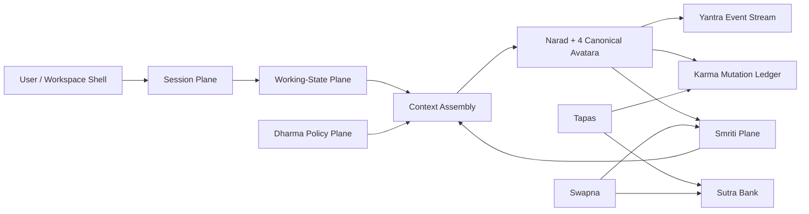

# Narad Harness Blueprint Deep Dive

_As of June 3, 2026_

## Executive Summary

This document compares four current reference systems:

- [Odysseus](https://github.com/pewdiepie-archdaemon/odysseus)
- [Hermes Agent](https://github.com/NousResearch/hermes-agent)
- [Codex](https://github.com/openai/codex)
- [OpenCode](https://github.com/anomalyco/opencode)

The goal is not a market summary. The goal is to decide what Narad should actually build next.

The high-level result is clear:

- **Odysseus** is strongest as a **workspace shell** and distribution story, not as the best core harness reference.
- **Hermes** is strongest on **memory ambition, session persistence, gateway reach, and “agent grows with you” product language**, but its memory stack is still too entangled and often too expensive in-context.
- **Codex** is strongest on **harness discipline**: prompt assembly, approvals, sandbox semantics, thread protocol, and explicit client/server boundaries.
- **OpenCode** is strongest on **open extensibility**: pluggable agents, server/SDK surfaces, skills, provider flexibility, and a broad ecosystem.

The most important shared lesson is negative:

> Most agent systems still conflate **thread continuity**, **working state**, and **durable memory**. That is why users keep reporting “memory loss” even when a system technically has memory.

Narad should not copy any one repo whole. It should combine:

- **Codex** for runtime protocol, approvals, and context assembly discipline
- **Hermes** for session lineage, session search, gateway thinking, and externalized learning loops
- **OpenCode** for server/SDK openness, agent configuration, plugins, and on-demand skills
- **Odysseus** for self-hosted workspace UX, consumer packaging, and multi-surface product coherence

The recommended Narad harness is therefore:

1. a **session plane** for durable threads and resumable lineage
2. a **working-state plane** for active task state, approvals, and artifacts
3. a **Smriti plane** for durable episodic/semantic/project memory
4. a **Dharma/Karma/Yantra plane** for safety, mutation logging, and observability
5. an optional **workspace shell** that sits above the harness, not inside it

## 1. Repo Deep Dossiers

### Odysseus

#### Core thesis

Odysseus positions itself as a self-hosted AI workspace: “the self-hosted version of the UI experience you get from ChatGPT and Claude,” with local-first and privacy-first framing. The README emphasizes chat, agent runs, model management, research, documents, memory/skills, email, tasks, calendar, and mobile/PWA support. Officially, it is a workspace with “shell access, file uploads, model downloads, web research, email/calendar integrations, and API tokens,” and the repo explicitly says to treat it like an admin console.  
Sources: [README](https://github.com/pewdiepie-archdaemon/odysseus/blob/main/README.md), [repo overview](https://github.com/pewdiepie-archdaemon/odysseus)

#### Agent loop and runtime model

Odysseus is not the cleanest reference for a standalone harness. Its own README says the agent surface is “built on opencode,” then layers in MCP, web, files, shell, skills, and memory. That makes it better understood as a **workspace product shell over an agent substrate** than as the substrate itself.  
Source: [README lines 243-268](https://github.com/pewdiepie-archdaemon/odysseus/blob/main/README.md)

#### Session continuity and context compaction

The public docs emphasize workspace data, agent features, and integrated surfaces, but do not present a notably differentiated session/compaction protocol. Compared with Codex and Hermes, continuity appears more product-facing than protocol-explicit.

#### Memory model

Odysseus presents “Persistent memory and skills” with ChromaDB, fastembed, vector + keyword retrieval, plus import/export. Data is spread across `app.db`, `memory.json`, `uploads/`, `personal_docs/`, and `chroma/`. This is useful and approachable, but architecturally it reads more like a bundled feature set than a strongly separated memory control plane.  
Source: [README lines 257-258, 243-258, 296-317](https://github.com/pewdiepie-archdaemon/odysseus/blob/main/README.md)

#### Subagent/workflow model

The project advertises an “Agent” mode, but its visible public framing is task execution inside a broader workspace, not a highly explicit multi-agent session protocol.

#### Tool/plugin/MCP surface

Its main value is breadth: model serving, shell, files, search, email, calendar, uploads, compare, and documents. It also exposes strong admin-gated surfaces, including MCP management, API tokens, webhooks, model serving, backup/vault, and app settings.  
Source: [repo overview security notes](https://github.com/pewdiepie-archdaemon/odysseus)

#### Safety/approval/sandbox model

The repo’s strongest safety signal is social rather than protocol-level: it repeatedly warns that the app should be treated like an admin console, recommends keeping auth on, and notes that non-admin users do not get shell/Python/file read/write by default. That is a good product warning, but not the same thing as a fine-grained harness approval model.  
Source: [repo overview security notes](https://github.com/pewdiepie-archdaemon/odysseus)

#### UI/workspace affordances

This is where Odysseus shines:

- self-hosted chat UI
- deep research reports
- compare views
- docs/editor
- notes/tasks
- calendar
- mobile/PWA story

It is the strongest reference in this set for “what an agent workspace should feel like” when built for regular users rather than only developer operators.  
Source: [README features](https://github.com/pewdiepie-archdaemon/odysseus/blob/main/README.md)

#### Deployment/self-hosting story

Odysseus is aggressively self-hosting-first: Docker path, native Linux/macOS path, Apple Silicon guidance, local bind defaults, and inside-app settings for model/search/email config. That makes it unusually legible for privacy-first users and creator audiences.  
Source: [README quick start](https://github.com/pewdiepie-archdaemon/odysseus/blob/main/README.md)

#### What is genuinely differentiated

- Better consumer-facing **self-hosted workspace packaging**
- Stronger **all-in-one personal AI shell** than most harness-first tools
- Strong creator-led distribution energy and fast awareness

#### What is mostly packaging

- The underlying harness loop is not its main innovation
- A lot of its differentiation comes from integration, surface area, and onboarding/product framing

#### Narad take

**Copy** the workspace posture, task/research/doc/calendar unification, and product warmth.  
**Do not copy** the tendency to let the workspace shell and harness core blur into one monolith.

---

### Hermes Agent

#### Core thesis

Hermes calls itself “the self-improving AI agent” and claims a built-in learning loop: skill creation, skill improvement during use, memory nudges, session search, and a growing user model across sessions. It also emphasizes gateway reach and deployment portability: CLI, messaging platforms, multiple terminal backends, and low-idle infrastructure.  
Sources: [README](https://github.com/NousResearch/hermes-agent/blob/main/README.md), [docs home](https://hermes-agent.nousresearch.com/docs/)

#### Agent loop and runtime model

Hermes is one of the most opinionated “outer agent” systems in the current OSS field:

- CLI + TUI
- messaging gateway
- cron scheduler
- isolated subagents
- toolsets
- skills
- session search
- optional memory providers

Its README also explicitly positions it as “not tied to your laptop,” which is a major conceptual shift from terminal-only copilots.  
Sources: [README lines 239-247](https://github.com/NousResearch/hermes-agent/blob/main/README.md), [messaging gateway docs](https://hermes-agent.nousresearch.com/docs/user-guide/messaging)

#### Session continuity and context compaction

Hermes is the strongest of the four on **user-facing session continuity**:

- every conversation is saved as a session
- sessions live in SQLite with full message history
- sessions can be resumed by title
- compression creates a new continuation session with lineage (`project` → `project #2`)
- session search is built in and uses FTS5

This is a better user story than “just resume by hidden thread ID.”  
Sources: [sessions docs](https://hermes-agent.nousresearch.com/docs/user-guide/sessions), [persistent memory docs](https://hermes-agent.nousresearch.com/docs/user-guide/features/memory/)

#### Memory model

Hermes has the most layered memory story in this set, but also the messiest one:

- built-in `MEMORY.md` and `USER.md`
- injected as a frozen snapshot at session start
- live writes persist immediately but are only injected next session
- FTS5 session search in `~/.hermes/state.db`
- eight external memory providers
- optional Honcho layer for user modeling and session summaries

This is directionally excellent because it distinguishes “always in prompt” memory from searchable historical memory. But it still mixes a lot of concepts:

- prompt memory
- historical session search
- external providers
- dialectic user modeling
- skill evolution

all under the same “memory” umbrella.  
Sources: [persistent memory docs](https://hermes-agent.nousresearch.com/docs/user-guide/features/memory/), [Honcho docs](https://hermes-agent.nousresearch.com/docs/user-guide/features/honcho/)

#### Subagent/workflow model

Hermes supports isolated subagents and parallel workstreams, but its own community has identified the missing next step: **shared memory pools or shared state between workers**. The issue is not just convenience; downstream tasks often need upstream context without routing everything back through a parent.  
Source: [Issue #377](https://github.com/NousResearch/hermes-agent/issues/377)

#### Tool/plugin/MCP surface

Hermes has a huge tool + skill surface:

- skill-first extension model
- messaging integrations
- external memory providers
- multiple backends
- delivery into chat
- tool gateway

The docs are unusually explicit that many capabilities should become **skills** rather than hard-coded tools. That is a strong architectural instinct.  
Sources: [creating skills](https://hermes-agent.nousresearch.com/docs/developer-guide/creating-skills), [tool gateway](https://hermes-agent.nousresearch.com/docs/user-guide/features/tool-gateway)

#### Safety/approval/sandbox model

Hermes has backend isolation, profile separation concepts, and configurable environments, but it is less crisp than Codex in approval semantics. It is more like a powerful agent operating environment than a granular “proposal → approval → execution” harness protocol.

#### UI/workspace affordances

Hermes is broad rather than polished:

- CLI/TUI
- browser dashboard limitations on native Windows
- messaging gateway
- cron automation
- file delivery in chat

Its UI advantage is ubiquity and reach, not a cohesive single workspace shell.  
Sources: [README](https://github.com/NousResearch/hermes-agent/blob/main/README.md), [messaging gateway docs](https://hermes-agent.nousresearch.com/docs/user-guide/messaging)

#### Deployment/self-hosting story

Hermes is excellent here:

- Linux/macOS/WSL2/Termux
- native Windows installer
- multiple execution backends
- cloud/serverless options
- portable Git Bash handling

It has the best “runs anywhere, not just your laptop” story in the set.  
Source: [README install + backends](https://github.com/NousResearch/hermes-agent/blob/main/README.md)

#### What is genuinely differentiated

- Session persistence + search as a first-class citizen
- Explicit built-in learning language and skill lifecycle
- Messaging gateway and multi-backend deployment reach
- Memory-provider ecosystem and peer-profile concept

#### What is mostly packaging or hype

- “Self-improving” often still depends on externalized skills and curated memory, not autonomous capability growth in the strong sense
- Some of the memory stack is real architecture; some of it is still “tell the agent to remember this” ritual plus a lot of prompt payload

#### Narad take

**Copy** the separation between tiny always-in-context memory and searchable session history, the session lineage UX, the skill-first extension discipline, and the gateway mentality.  
**Do not copy** the tendency to keep piling more providers and context layers directly into the core loop.

---

### Codex

#### Core thesis

Codex is the cleanest example here of a modern agent harness with an explicit runtime protocol. OpenAI’s own engineering write-up frames it as a cross-platform local software agent with a clear “agent loop” and emphasizes safe, efficient operation on the user’s machine.  
Sources: [Codex Rust README](https://github.com/openai/codex/blob/main/codex-rs/README.md), [Unrolling the Codex agent loop](https://openai.com/index/unrolling-the-codex-agent-loop/)

#### Agent loop and runtime model

Codex is the strongest reference for how a harness should be shaped internally:

- explicit turn/thread model
- prompt assembly through ordered message roles
- tool list + inputs + instructions
- internal event objects over SSE
- app-server protocol for rich clients

OpenAI’s “Unrolling the Codex agent loop” post is especially useful because it exposes the harness decisions directly:

- conversation history is included every turn
- context window management is a harness responsibility
- sandbox instructions are injected as a dedicated developer message
- AGENTS and skills are aggregated into user instructions
- environment context is injected separately  
Sources: [OpenAI engineering post](https://openai.com/index/unrolling-the-codex-agent-loop/), [app-server README](https://github.com/openai/codex/blob/main/codex-rs/app-server/README.md)

#### Session continuity and context compaction

Codex has a strong protocol but mixed field reliability:

- `thread/start`
- start or resume thread semantics
- rollback
- background terminals
- session-scoped permissions

But community and issue evidence shows repeated failures around:

- missing resume entries
- stale permission context after resume
- inability to compact long-running sessions
- sessions not rehydrating from disk after in-memory loss

The architecture is strong; the edge cases show how hard continuity really is.  
Sources: [app-server README](https://github.com/openai/codex/blob/main/codex-rs/app-server/README.md), [Issue #21619](https://github.com/openai/codex/issues/21619), [Issue #12596](https://github.com/openai/codex/issues/12596), [Issue #8310](https://github.com/openai/codex/issues/8310), [Issue #10823](https://github.com/openai/codex/issues/10823)

#### Memory model

Codex is not trying to be a “persistent memory product” in the Hermes sense. Its bias is:

- thread history
- AGENTS/project instructions
- skills
- configurable memories writable under `~/.codex/memories`

This makes it architecturally cleaner for coding workflows, but weaker if you want a full personal memory system.  
Sources: [Codex Rust README](https://github.com/openai/codex/blob/main/codex-rs/README.md), [OpenAI engineering post](https://openai.com/index/unrolling-the-codex-agent-loop/)

#### Subagent/workflow model

Codex exposes one of the most explicit collaboration surfaces in the set:

- `spawn_agent`
- `send_input`
- `resume_agent`
- `wait`
- `close_agent`

The app-server protocol even emits structured `collabToolCall` events. This is the cleanest protocol-level representation of multi-agent collaboration in the comparison set.  
Source: [app-server README](https://github.com/openai/codex/blob/main/codex-rs/app-server/README.md)

#### Tool/plugin/MCP surface

Codex is strong here in a different way from OpenCode:

- MCP client
- experimental MCP server
- dynamic tools
- standalone skills
- app mentions/connectors

The system is not as socially “hackable” as OpenCode, but its interfaces are more rigorously specified.  
Sources: [Codex Rust README](https://github.com/openai/codex/blob/main/codex-rs/README.md), [app-server README](https://github.com/openai/codex/blob/main/codex-rs/app-server/README.md)

#### Safety/approval/sandbox model

This is where Codex is best-in-class.

It has:

- explicit sandbox modes
- separate approval policies
- command approvals
- file change approvals
- permission requests
- session-scoped grants
- auto-review approval routing
- just-in-time request/resolve lifecycle

No other repo in this set matches Codex on approval semantics and reviewability.  
Sources: [Codex Rust README](https://github.com/openai/codex/blob/main/codex-rs/README.md), [app-server README approvals](https://github.com/openai/codex/blob/main/codex-rs/app-server/README.md)

#### UI/workspace affordances

Codex has a TUI, desktop app, MCP/app-server protocol, and strong client semantics, but it is still primarily a harness/tooling product rather than a full self-hosted personal workspace.

#### Deployment/self-hosting story

Codex supports npm, Homebrew, direct releases, configurable endpoints, and local OSS responses endpoints. That is good, but the strongest deployment story is still “developer local agent,” not “personal AI infrastructure.”  
Sources: [Codex Rust README](https://github.com/openai/codex/blob/main/codex-rs/README.md), [OpenAI engineering post](https://openai.com/index/unrolling-the-codex-agent-loop/)

#### What is genuinely differentiated

- Strongest harness protocol and approval model
- Best explicit context assembly story
- Strongest typed client/server boundary
- Serious collaboration and event semantics

#### What is mostly packaging

- The desktop and UI layers are useful, but the deeper differentiation is the runtime protocol, not the chrome

#### Narad take

**Copy** the approval model, thread/turn/event protocol, dynamic tool contract, and context-assembly discipline.  
**Do not copy** the assumption that thread history alone is enough to stand in for a true durable memory system.

---

### OpenCode

#### Core thesis

OpenCode is the most energetic open-source coding-agent ecosystem in the comparison set. Its public thesis is straightforward: open coding agent, terminal-first, provider-flexible, configurable, extensible, and exposed over a reusable server/SDK surface.  
Sources: [repo](https://github.com/anomalyco/opencode), [server docs](https://opencode.ai/docs/server/), [agents docs](https://opencode.ai/docs/agents/)

#### Agent loop and runtime model

OpenCode exposes a full headless HTTP server with an OpenAPI surface:

- session creation/listing/forking/sharing/reverting
- message sending
- shell runs
- todo state
- diff retrieval
- summarization
- provider management

This makes it unusually composable and easy to embed. It also has built-in primary and subagents:

- Build
- Plan
- General
- Explore
- Scout
- hidden compaction/title/summary agents  
Sources: [server docs](https://opencode.ai/docs/server/), [agents docs](https://opencode.ai/docs/agents/)

#### Session continuity and context compaction

OpenCode has the right primitives:

- sessions
- child sessions
- forks
- summaries
- revert/unrevert
- share/unshare

But a lot of its current user pain is around context and session stability:

- large `AGENTS.md` files can consume most of the context window immediately
- compaction threshold is a frequent complaint
- long-running unattended sessions can stall
- repeated near-window request loops happen
- task calls that look parallel often execute sequentially

OpenCode has more flexibility than reliability at the moment.  
Sources: [server docs](https://opencode.ai/docs/server/), [Issue #18037](https://github.com/anomalyco/opencode/issues/18037), [Issue #11314](https://github.com/anomalyco/opencode/issues/11314), [Issue #15778](https://github.com/anomalyco/opencode/issues/15778), [Issue #16589](https://github.com/anomalyco/opencode/issues/16589), [Issue #14195](https://github.com/anomalyco/opencode/issues/14195)

#### Memory model

OpenCode is less of a built-in memory system than Hermes. Its strength is configurable instructions, sessions, summaries, agents, skills, and plugins rather than a first-party long-term memory theory.

That is a feature, not a bug, but it means Narad should learn more from OpenCode’s **extension architecture** than from its memory story.

#### Subagent/workflow model

OpenCode’s agent configuration model is excellent:

- primary vs subagents
- per-agent prompts
- per-agent models
- per-agent permissions
- child session navigation

What it still lacks is the strongest possible multi-agent runtime:

- current subtask execution pain is often sequential
- agent teams are still an active design topic

So OpenCode is ahead on **agent configuration UX**, but not yet the strongest on truly collaborative multi-agent execution.  
Sources: [agents docs](https://opencode.ai/docs/agents/), [Issue #12711](https://github.com/anomalyco/opencode/issues/12711), [Issue #14195](https://github.com/anomalyco/opencode/issues/14195)

#### Tool/plugin/MCP surface

This is OpenCode’s strongest technical category:

- plugins from local files or npm
- hook system
- custom tools
- SDK client
- server mode
- MCP servers
- 75+ model/provider flexibility
- skills discovered from `.opencode`, `.claude`, and `.agents`

It is the most hackable and swappable of the four.  
Sources: [plugins docs](https://opencode.ai/docs/plugins/), [skills docs](https://opencode.ai/docs/skills/), [agents docs](https://opencode.ai/docs/agents/), [server docs](https://opencode.ai/docs/server/)

#### Safety/approval/sandbox model

OpenCode has a strong permission system in principle:

- allow / ask / deny
- pattern-based rules
- per-agent overrides
- `doom_loop`
- `external_directory`
- skill/task/webfetch/websearch gating

But the defaults are more permissive than Codex, and community feedback repeatedly flags this as risky.  
Sources: [permissions docs](https://opencode.ai/docs/permissions), [HN thread](https://news.ycombinator.com/item?id=47460525)

#### UI/workspace affordances

OpenCode has TUI, web, IDE, server, share links, and session navigation. It is less cohesive than Odysseus as a workspace, but more open and composable.

#### Deployment/self-hosting story

OpenCode is excellent for developers and teams who want to own the protocol and swap providers. It is less turnkey for mainstream self-hosted users than Odysseus.

#### What is genuinely differentiated

- Best extensibility model
- Strongest agent/plugin/server openness
- Great subagent configuration model
- Strong SDK/server story

#### What is mostly packaging or risk

- “open everything” can drift into “monolith agent OS”
- public share model and server sync can surprise privacy-sensitive users
- very high release velocity is both a strength and a trust tax

#### Narad take

**Copy** the server/SDK openness, plugin hooks, skills discovery, per-agent permissions, and reusable session APIs.  
**Do not copy** the permissive defaults, auto-publicity surfaces, or context-bloat tolerance.

## 2. Community Voice and Demand Map

### Adoption energy

#### Odysseus

Odysseus has creator-led viral energy. Its launch immediately generated issue traffic from users trying native Windows, mobile, Docker, local models, and remote integrations. The strongest emotional demand is not “best harness internals,” it is:

- private alternative to corporate AI
- self-hosted workspace that feels consumer-grade
- one surface for research, chat, tasks, documents, and models

Signals: [repo issues](https://github.com/pewdiepie-archdaemon/odysseus/issues), [HN thread mirror](https://tech-for-dev.vercel.app/hn/48346693), [Reddit reaction](https://www.reddit.com/r/aiwars/comments/1ttt8j6/pewdiepie_releases_self_hosted_ai_workspace/)

#### Hermes

Hermes has the strongest “power-user local agent” energy. Its community is obsessed with:

- memory
- self-improvement
- profiles
- gateways
- local/cloud hybrid deployment

The emotional hook is that the agent should get more useful over time and live across contexts, not just inside one terminal session.  
Signals: [README](https://github.com/NousResearch/hermes-agent/blob/main/README.md), [LocalLLaMA AMA snippet](https://www.reddit.com/r/LocalLLaMA/comments/1sz2y76/ama_with_nous_research_ask_us_anything/), [Hermes memory thread](https://www.reddit.com/r/LocalLLaMA/comments/1ro9lph/anybody_who_tried_hermesagent/)

#### Codex

Codex has the strongest “serious harness” trust story:

- approvals
- sandboxing
- predictable structure
- enterprise/developer confidence

Its community asks less for magic and more for reliability and controllability.  
Signals: [OpenAI engineering post](https://openai.com/index/unrolling-the-codex-agent-loop/), [app-server README](https://github.com/openai/codex/blob/main/codex-rs/app-server/README.md), [trust discussion](https://www.reddit.com/r/codex/comments/1t5uwtc/how_many_of_you_trust_codex/)

#### OpenCode

OpenCode has the loudest open-source builder energy:

- huge contributor motion
- HN virality
- provider-neutral appeal
- plugin and multi-agent experimentation

Its users are drawn by openness and flexibility, but also spend a lot of time discussing breakage, defaults, and operational churn.  
Signals: [HN launch thread](https://news.ycombinator.com/item?id=47460525), [repo issues](https://github.com/anomalyco/opencode/issues), [share docs](https://opencode.ai/docs/share/)

### Shared pain taxonomy

| Taxonomy | What communities keep saying | Strongest examples | Narad implication |
|---|---|---|---|
| Continuity | “It forgot what we were doing” usually means session/thread state broke, not that memory was absent | Codex resume/rehydration bugs; Hermes sidecar-memory discussion; OpenCode session churn | Separate thread durability, working state, and Smriti |
| Context bloat | Large prompt payloads are killing coherence and cost | Hermes autoload memory + skills complaints; OpenCode AGENTS compaction loops; Codex compaction failures | Keep always-in-context state tiny and aggressively typed |
| Approval/safety friction | Users want safety, but not opaque blocking | Codex trust threads; OpenCode permission tuning; Odysseus admin-console warnings | Make approvals explicit, scoped, reviewable, and persistent by session |
| Local/private deployment | Users want privacy and ownership without DevOps pain | Odysseus excitement; Hermes $5 VPS/serverless reach; OpenCode share skepticism | Cloud now, local later must still preserve privacy-first seams |
| Multi-agent coordination | Users want specialists, but not black-box delegation | Hermes shared memory pool request; OpenCode team design issue; Codex collab protocol | Support teams only when state-sharing rules are explicit |
| Memory quality | Users do not want “stuffed prompt memory”; they want useful recall | Hermes memory debates; external sidecars for Codex/Hermes; Narad’s own continuity bug history | Long-term memory should be searchable, provenance-backed, and separate from thread history |
| Installation/distribution | Viral adoption exposes every install footgun instantly | Odysseus Windows/mobile confusion; Hermes installer praise; Codex npm/native confusion | Treat install/onboarding as product architecture, not docs afterthought |
| UI/observability | Users want to see what the agent is doing and why | Codex event protocol; OpenCode child sessions; Odysseus workspace visibility | Narad should expose trace, approvals, lineage, memory, and evolution in one shell |
| Model/provider flexibility | People want to switch models without changing habits | Hermes and OpenCode are winning here | Narad needs a provider-neutral core |
| Unattended reliability | Long-running tasks still stop, loop, or rot | OpenCode unattended-run complaints; Hermes overhead/state issues; Codex compaction strain | Narad needs an explicit long-run mode with bounded state and recovery |

### What users praise vs tolerate vs complain about

#### Odysseus

- **Praise:** self-hosted vibe, integrated workspace, privacy posture, compare/research/docs/tasks mix
- **Tolerate:** rough edges because it feels fun and creator-led
- **Complain:** native Windows gaps, install ambiguity, mobile confusion, repo issue hygiene, environment/runtime fragility  
Sources: [Issue #184](https://github.com/pewdiepie-archdaemon/odysseus/issues/184), [Issue #192](https://github.com/pewdiepie-archdaemon/odysseus/issues/192), [Issue #106](https://github.com/pewdiepie-archdaemon/odysseus/issues/106)

#### Hermes

- **Praise:** easiest path to a “living” agent, memory/search, gateway reach, skills, profiles, local/cloud optionality
- **Tolerate:** complexity, many moving pieces, external memory providers, higher prompt overhead
- **Complain:** token waste, unclear self-improvement boundaries, memory/provider entanglement, isolation leaks, profile contamination, weak shared-state workflows  
Sources: [Issue #5563](https://github.com/NousResearch/hermes-agent/issues/5563), [Issue #3943](https://github.com/NousResearch/hermes-agent/issues/3943), [Issue #10376](https://github.com/NousResearch/hermes-agent/issues/10376), [Reddit thread](https://www.reddit.com/r/LocalLLaMA/comments/1s43ts3/hermes_agent_memorylearning_i_dont_get_it/)

#### Codex

- **Praise:** strongest trust/safety posture, precise approvals, better harness semantics than most hypeware, powerful AGENTS/skills model
- **Tolerate:** some resume/compaction roughness because protocol is strong
- **Complain:** resume discovery failures, stale continuity after compaction, Windows/MCP issues, confusion between packaged and native installs  
Sources: [Issue #21619](https://github.com/openai/codex/issues/21619), [Issue #21839](https://github.com/openai/codex/issues/21839), [Issue #12596](https://github.com/openai/codex/issues/12596), [HN thread](https://news.ycombinator.com/item?id=43708025)

#### OpenCode

- **Praise:** open, fast-moving, provider-flexible, hackable, strong server/SDK/plugin model, useful built-in agents
- **Tolerate:** churn because it evolves quickly
- **Complain:** permissive defaults, share/privacy ambiguity, context explosions, compaction weirdness, sequential “parallelism,” long unattended runs breaking  
Sources: [HN thread](https://news.ycombinator.com/item?id=47460525), [Issue #18037](https://github.com/anomalyco/opencode/issues/18037), [Issue #15778](https://github.com/anomalyco/opencode/issues/15778), [Issue #16589](https://github.com/anomalyco/opencode/issues/16589)

## 3. Cross-Repo Harness Comparison

| Category | Best current reference | Why | Narad should do |
|---|---|---|---|
| Runtime loop | Codex | Cleanest explicit harness semantics and prompt/event model | Copy the protocol discipline |
| Session durability | Hermes | Best user-facing save/resume/title/lineage story | Copy the lineage and search model |
| Working-state persistence | None fully solve it | Everyone stores history; few store active task state cleanly | Make working state a first-class plane |
| Long-context compaction | Codex architecture, Hermes UX | Codex thinks about it best; Hermes handles continuation sessions better | Combine both |
| Subagent collaboration | Codex protocol, OpenCode UX | Codex has explicit collab semantics; OpenCode has child-session usability | Use explicit agent/session topology |
| Approval ergonomics | Codex | Best-in-class request/approve/deny/session-grant semantics | Copy nearly wholesale |
| Skills/extensions | OpenCode + Codex + Hermes | OpenCode plugins/skills, Codex skills/dynamic tools, Hermes skill-first philosophy | Blend into one extension surface |
| Memory ambition | Hermes | Most serious memory product thinking | Narrow and simplify it |
| Workspace shell | Odysseus | Best consumer-facing self-hosted workspace | Borrow the shell, not the core |
| Model/provider flexibility | OpenCode + Hermes | Strong provider-neutral setups | Make Narad provider-neutral |
| Observability | Codex | Rich app-server lifecycle and typed events | Codify Yantra around typed events |
| Maintainability | Codex | Strongest boundaries between protocol/runtime/client | Keep core small and typed |

### Features worth copying

#### Copy directly

- **Codex**
  - approval protocol
  - sandbox policy model
  - dynamic tools
  - skill loading contract
  - thread/turn/event vocabulary
- **Hermes**
  - title-based session resume
  - continuation session lineage after compression
  - searchable session archive
  - tiny curated always-in-context memory
- **OpenCode**
  - server/SDK separation
  - plugins/hooks
  - per-agent permission overrides
  - skills discovered from repo/global roots
- **Odysseus**
  - integrated research/tasks/docs/calendar shell
  - self-hosted first-run simplicity
  - mobile-aware workspace framing

#### Adapt carefully

- Hermes “self-improvement” should become Narad **Sutra/Tapas/Swapna**, not a free-form auto-learning blob
- OpenCode child sessions should become Narad **explicit avatāra workrooms**
- Odysseus deep research and compare should become optional **workspace surfaces**, not harness primitives
- Codex AGENTS aggregation should stay bounded so project docs do not eat the whole context window

#### Architecturally dangerous features

- giant always-in-prompt memory blocks
- unbounded AGENTS or project instructions
- auto-sharing sessions to remote servers by default
- permissive tool defaults on local filesystems
- “parallel agents” without explicit shared-state or isolation policy
- memory providers hard-wired into the core loop
- monolithic “agent OS” sprawl where shell, memory, plugins, UI, and learning are inseparable

## 4. Narad Best-of Blueprint

### Design principles

1. **Keep the harness smaller than the workspace**
   - The core harness should be reusable without the dashboard shell.
2. **Separate continuity from memory**
   - Thread continuity is not the same thing as durable memory.
3. **Make safety explicit**
   - No hidden auto-run of risky actions.
4. **Keep long-term learning externalized**
   - Skills, rules, and profiles should evolve faster than core runtime code.
5. **Prefer inspectable state over magic**
   - If Narad “learns,” users should be able to see what changed and why.

### The target Narad harness

### Plane 1: Session Plane

This plane owns **exact conversation continuity**.

It should provide:

- durable thread IDs
- human titles
- lineage (`resume`, `fork`, `compress`, `archive`, `recover`)
- exact recent turns
- parent/child relationships
- attachment history

It should not pretend to be long-term memory.

#### Session API

- `session.create({ title?, parent_id?, source, cwd?, provider? }) -> Session`
- `session.resume({ id? | title? | latest? }) -> SessionState`
- `session.fork({ session_id, turn_id? }) -> Session`
- `session.compact({ session_id }) -> ContinuationSession`
- `session.archive({ session_id }) -> bool`
- `session.recover({ session_id }) -> Session`
- `session.list({ source?, limit?, lineage? }) -> Session[]`

### Plane 2: Working-State Plane

This plane owns the **active task canvas** for a session.

It should store:

- current plan
- Karya board/task cards
- pending approvals
- active avatars
- open artifacts/diffs
- current tool context
- last meaningful result digest
- pending questions/blockers

This is the missing layer in most systems.

#### Working-State API

- `working.load(session_id) -> WorkingState`
- `working.save(session_id, patch) -> WorkingState`
- `working.snapshot(session_id) -> WorkingSnapshot`
- `working.clear(session_id) -> bool`

### Plane 3: Smriti Plane

This plane owns **durable retained knowledge**, not raw thread continuity.

It should contain:

- episodic evidence
- semantic memory
- project memory/wiki
- provenance
- profile memory
- retrieved rules and commitments

Smriti should remain searchable and provenance-backed, but compact in prompt usage.

#### Memory API

- `smriti.capture_episode(session_id, turn_id, task, result, avatar, provenance)`
- `smriti.recall(query, user_id, project_id?, scope, budget) -> ContextBundle`
- `smriti.search_sessions(query, filters) -> SessionHit[]`
- `smriti.promote_sutra(candidate_id) -> Sutra`
- `smriti.update_sankalpa(commitment_patch) -> Sankalpa`
- `smriti.get_provenance(entity_id) -> ProvenanceBundle`
- `smriti.consolidate_swapna(batch_id?) -> SwapnaResult`

### Plane 4: Dharma / Karma / Yantra Plane

This plane owns governance and observability.

#### Dharma

Dharma should become the canonical policy layer for:

- sandbox mode
- approval mode
- tool-family permissions
- path permissions
- network permissions
- agent-specific policies
- “public share” policies
- mutation and promotion gates

#### Safety API

- `policy.evaluate(action, actor, session_id, context) -> Proposal`
- `policy.request_approval(proposal) -> ApprovalRequest`
- `policy.approve_once(request_id)`
- `policy.approve_session(request_id, grant)`
- `policy.deny(request_id)`

#### Karma

Karma should log every meaningful state change:

- session creation/fork/compact/archive/recover
- file mutation
- approval grant/deny
- Smriti writes
- Sutra promotions/reverts
- Sankalpa changes
- Swapna consolidations
- provider/config/runtime changes

#### Yantra

Yantra should expose typed, inspectable runtime events:

- `turn_started`
- `context_built`
- `avatar_started`
- `tool_proposed`
- `approval_requested`
- `approval_resolved`
- `avatar_completed`
- `working_state_updated`
- `session_compacted`
- `memory_promoted`
- `swapna_completed`
- `turn_completed`

#### Observability API

- `trace.session(session_id) -> SessionTrace`
- `trace.turn(turn_id) -> TurnTrace`
- `trace.events(filters) -> Event[]`
- `trace.evolution(agent?, category?) -> EvolutionSeries`

### Agent/team model

Narad should preserve the 4 canonical agents:

- `Matsya`
- `Rama`
- `Krishna`
- `Parashurama`

But the harness beneath them should support two execution modes:

1. **Single-agent turn**
   - default
2. **Team workflow**
   - parent session + child workrooms
   - bounded delegation
   - explicit shared-state access rules

#### Agent/Team API

- `agent.run(session_id, avatar, input, context_bundle) -> Turn`
- `agent.delegate(parent_session_id, avatar, task, share=["working","smriti:none"]) -> ChildSession`
- `agent.message(child_session_id, input) -> Turn`
- `agent.complete(child_session_id) -> ResultDigest`
- `agent.join(parent_session_id, child_session_ids) -> Synthesis`

Shared state must be explicit:

- default child isolation
- opt-in read access to working state
- opt-in writeback for approved result channels only

This avoids both extremes:

- Hermes-style over-isolation
- uncontrolled shared-memory chaos

### Context assembly order

Narad should build context in this order:

1. `Dharma`
   - permissions, safety, current policy mode
2. `Thread memory`
   - recent exact turns + continuation summaries
3. `Working state`
   - active plan, tasks, approvals, artifacts
4. `Sankalpa`
   - user/project commitments and preferences
5. `Sutra`
   - approved reusable rules relevant to the turn
6. `Smriti recall`
   - durable memories retrieved for the query
7. `Current user turn`

That order matters. It keeps continuity, execution state, and durable recall separate.

### Extension surface

Narad should unify the best parts of Codex/OpenCode/Hermes:

- repo-local skills
- user-global skills
- MCP tools
- provider adapters
- plugin hooks
- local/cloud transport abstraction

#### Extension API

- `skills.list(cwd?)`
- `skills.load(name, session_id)`
- `mcp.register(server)`
- `plugin.register(hooks)`
- `provider.register(adapter)`

#### Skill conventions

- discover from repo and global roots
- load full contents on demand
- keep metadata lightweight
- allow policy gating by skill name/family
- allow avatāra-specific skill permissions

### Self-improvement and evolution

Narad should be honest about what “self-improving” means.

#### Real self-improvement

- better reusable skills
- better compact rules
- better retrieval policies
- better profile/commitment updates
- better failure recovery patterns

#### Not live self-modifying chaos

- no auto-editing core runtime without benchmark gates
- no hidden model-weight mutation in production
- no silent prompt mutation with no provenance

#### Tapas

Tapas should evaluate:

- output quality
- retrieval quality
- skill usefulness
- failure mode classification
- approval quality

#### Sutra

Sutras should be:

- compact
- approved
- attributable
- revertible

#### Swapna

Swapna should run offline or out-of-band:

- summarize long threads
- consolidate episodic evidence
- synthesize candidate Sutras
- refine Sankalpa
- propose retrieval-policy changes

### Cultural-core mapping

| Narad cultural term | Harness meaning |
|---|---|
| Dharma | sandbox, approval, policy, permission, and promotion gates |
| Karma | immutable mutation and consequence ledger |
| Smriti | durable memory and provenance plane |
| Sankalpa | user/project goals, commitments, preferences |
| Sutra | compact approved reusable instructions and patterns |
| Tapas | evaluation, critique, and promotion engine |
| Swapna | offline consolidation, compaction, and evolution |
| Yantra | event protocol, traces, metrics, and operational visibility |

One important rule:

> Do **not** force raw thread continuity into Smriti.

Thread continuity and working state are runtime substrate concerns. Smriti should remain the durable memory plane above them.

## 5. What Narad Can Solve That These Repos Still Miss

### Direct answers to the validation questions

#### Why do users keep losing continuity even when “memory” exists?

Because most systems treat the following as if they were one thing:

- exact thread history
- active task/working state
- long-term durable memory

They are not one thing.

If a system saves memory but loses the active thread or current task canvas, the user still experiences amnesia. If a system keeps the thread but loses the current plan, approvals, or artifacts, the user still experiences derailment. If a system remembers facts but not the active work context, it still feels forgetful.

#### Which repo has the best answer for session durability?

**Hermes** has the best user-facing answer today:

- automatic sessions
- searchable SQLite history
- resumable titles
- compression lineage

**Codex** has the best protocol answer, but its field issues show the operational work is still hard.

#### Which repo has the best answer for working-state persistence?

No repo solves this cleanly.

Hermes gets closest with session summaries and gateway continuity. Codex has the best protocol surface to support it. But none treats working state as a durable, first-class plane as clearly as Narad should.

#### Which repo has the best answer for long-context compaction?

No repo fully wins.

- **Codex** has the best architecture for thinking about context management
- **Hermes** has the best user-facing continuation lineage after compression
- **OpenCode** is currently the most visibly stressed by compaction pathologies

#### Which repo has the best answer for subagent collaboration?

Again, split answer:

- **Codex** has the best protocol semantics
- **OpenCode** has the best end-user child-session navigation today
- **Hermes** has the right ambition but still wants shared-memory workflow primitives

#### Which repo has the best answer for approval ergonomics?

**Codex**, clearly.

#### Which repo has the best answer for self-hosted UX?

**Odysseus**, clearly.

#### Which “self-improving” claims are real vs hype?

**Real:**

- Hermes externalized skill creation and cross-session memory/search
- Codex skills and structured instruction aggregation
- OpenCode plugin/skill extensibility and agent specialization

**Mostly hype or incomplete:**

- any claim where “self-improvement” mainly means “the user can tell it to remember something”
- any system that stuffs more and more prompt context into the turn and calls that learning
- any “parallel multi-agent” story without explicit shared-state semantics

### Narad’s gap thesis

Narad can solve the category’s biggest unsolved problem:

> Build a harness that is **stateful in the right layers**, **inspectable by default**, **safe without becoming rigid**, and **personal/workspace-native without collapsing into monolithic sprawl**.

The specific unsolved frustrations Narad can address are:

1. **Continuity without context bloat**
   - durable thread memory
   - durable working state
   - compact Smriti retrieval

2. **Trustable local-first behavior**
   - explicit remote-sharing boundaries
   - no surprise sync surfaces
   - per-tool/provider visibility

3. **Real multi-agent work without black-box chaos**
   - child workrooms
   - explicit shared-state policies
   - result-digest synthesis

4. **A learning loop users can actually see**
   - what Tapas scored
   - what became a Sutra
   - what Swapna consolidated
   - what Karma recorded

5. **A cohesive workspace shell over a small, reusable harness**
   - Narad should not become “yet another agent OS blob”
   - it should stay a clear harness plus a beautiful workspace shell

### Smallest coherent Narad harness

If Narad wants the minimum credible vNext harness, it only needs:

1. **Session Plane**
   - create/resume/fork/compact/archive/recover
2. **Working-State Plane**
   - plan, approvals, tasks, artifacts
3. **Smriti Plane**
   - episodic + semantic + project memory
4. **Dharma Policy Engine**
   - sandbox + approvals + grants
5. **Yantra Event Stream**
   - typed traces and UI visibility
6. **Sutra/Tapas/Swapna**
   - externalized learning loop

Everything else, including workspace UI, can sit above that.

That is the simplest build that would already solve more real user pain than the current category leaders.

## Source Appendix

### Official sources

#### Odysseus

- [Odysseus README](https://github.com/pewdiepie-archdaemon/odysseus/blob/main/README.md)
- [Odysseus repo overview](https://github.com/pewdiepie-archdaemon/odysseus)

#### Hermes

- [Hermes README](https://github.com/NousResearch/hermes-agent/blob/main/README.md)
- [Hermes docs home](https://hermes-agent.nousresearch.com/docs/)
- [Persistent memory docs](https://hermes-agent.nousresearch.com/docs/user-guide/features/memory/)
- [Honcho docs](https://hermes-agent.nousresearch.com/docs/user-guide/features/honcho/)
- [Sessions docs](https://hermes-agent.nousresearch.com/docs/user-guide/sessions)
- [Messaging gateway docs](https://hermes-agent.nousresearch.com/docs/user-guide/messaging)
- [Creating skills docs](https://hermes-agent.nousresearch.com/docs/developer-guide/creating-skills)

#### Codex

- [Codex Rust README](https://github.com/openai/codex/blob/main/codex-rs/README.md)
- [Codex app-server README](https://github.com/openai/codex/blob/main/codex-rs/app-server/README.md)
- [Unrolling the Codex agent loop](https://openai.com/index/unrolling-the-codex-agent-loop/)

#### OpenCode

- [OpenCode repo](https://github.com/anomalyco/opencode)
- [Agents docs](https://opencode.ai/docs/agents/)
- [Permissions docs](https://opencode.ai/docs/permissions)
- [Skills docs](https://opencode.ai/docs/skills/)
- [Plugins docs](https://opencode.ai/docs/plugins/)
- [Server docs](https://opencode.ai/docs/server/)
- [Share docs](https://opencode.ai/docs/share/)

### Community and issue signals

#### Odysseus

- [Issue #55: Hermes Agent integration](https://github.com/pewdiepie-archdaemon/odysseus/issues/55)
- [Issue #184: installation pain report](https://github.com/pewdiepie-archdaemon/odysseus/issues/184)
- [Issue #192: native Windows compatibility bug](https://github.com/pewdiepie-archdaemon/odysseus/issues/192)
- [Issue #106: mobile confusion](https://github.com/pewdiepie-archdaemon/odysseus/issues/106)
- [HN thread mirror](https://tech-for-dev.vercel.app/hn/48346693)
- [Reddit reaction](https://www.reddit.com/r/aiwars/comments/1ttt8j6/pewdiepie_releases_self_hosted_ai_workspace/)

#### Hermes

- [Issue #377: shared memory pools between sub-agents](https://github.com/NousResearch/hermes-agent/issues/377)
- [Issue #3943: MemoryProvider interface request](https://github.com/NousResearch/hermes-agent/issues/3943)
- [Issue #10376: profile isolation incomplete](https://github.com/NousResearch/hermes-agent/issues/10376)
- [Issue #12238: backup/version control for agent data](https://github.com/NousResearch/hermes-agent/issues/12238)
- [Issue #5563: memory persistence + token waste field report](https://github.com/NousResearch/hermes-agent/issues/5563)
- [Issue #5544: memory-provider tool injection latency](https://github.com/NousResearch/hermes-agent/issues/5544)
- [Reddit: “memory/learning I don't get it”](https://www.reddit.com/r/LocalLLaMA/comments/1s43ts3/hermes_agent_memorylearning_i_dont_get_it/)
- [Reddit: “Anybody who tried Hermes-Agent?”](https://www.reddit.com/r/LocalLLaMA/comments/1ro9lph/anybody_who_tried_hermesagent/)
- [AMA thread](https://www.reddit.com/r/LocalLLaMA/comments/1sz2y76/ama_with_nous_research_ask_us_anything/)
- [HN discussion stub](https://news.ycombinator.com/item?id=47264225)

#### Codex

- [Issue #21619: resume list omission](https://github.com/openai/codex/issues/21619)
- [Issue #21839: previous full-access sessions requiring approvals](https://github.com/openai/codex/issues/21839)
- [Issue #12596: rehydrate sessions from disk](https://github.com/openai/codex/issues/12596)
- [Issue #8310: resume after rate limit loses task intent](https://github.com/openai/codex/issues/8310)
- [Issue #10823: unable to compact long running session](https://github.com/openai/codex/issues/10823)
- [Issue #20867: Windows desktop unresponsive on long threads](https://github.com/openai/codex/issues/20867)
- [Issue #16574: Windows MCP tool load failure](https://github.com/openai/codex/issues/16574)
- [HN: launch thread](https://news.ycombinator.com/item?id=43708025)
- [HN: Rust/native rewrite](https://news.ycombinator.com/item?id=44150093)
- [Reddit trust discussion](https://www.reddit.com/r/codex/comments/1t5uwtc/how_many_of_you_trust_codex/)

#### OpenCode

- [Issue #18037: large AGENTS.md consumes context window](https://github.com/anomalyco/opencode/issues/18037)
- [Issue #11314: configurable compaction threshold](https://github.com/anomalyco/opencode/issues/11314)
- [Issue #12711: agent teams design](https://github.com/anomalyco/opencode/issues/12711)
- [Issue #15778: repeated requests near context window](https://github.com/anomalyco/opencode/issues/15778)
- [Issue #16589: unattended long runs stop](https://github.com/anomalyco/opencode/issues/16589)
- [Issue #14195: multiple task calls execute sequentially](https://github.com/anomalyco/opencode/issues/14195)
- [HN launch discussion](https://news.ycombinator.com/item?id=47460525)
- [Reddit/HN repost](https://www.reddit.com/r/hackernews/comments/1rza7w7/opencode_the_open_source_ai_coding_agent/)
